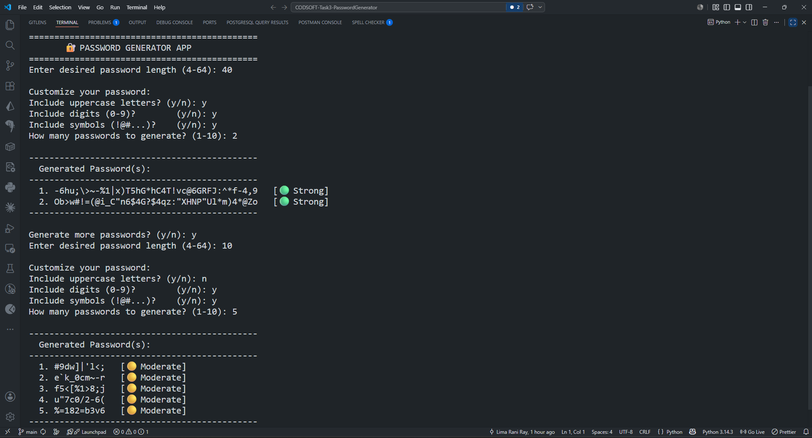

# 🔐 Password Generator


> A Python-based **Password Generator** that creates strong, random passwords with customizable length and complexity — including uppercase letters, digits, and symbols — with a built-in password strength indicator.
> Developed as part of the **CodSoft Python Programming Internship — Task 3**.

---

## 📌 Table of Contents

- [🔐 Password Generator](#-password-generator)
  - [📌 Table of Contents](#-table-of-contents)
  - [📖 About the Project](#-about-the-project)
  - [✨ Features](#-features)
  - [🛠️ Technologies Used](#️-technologies-used)
  - [📁 Folder Structure](#-folder-structure)
  - [▶️ How to Run](#️-how-to-run)
    - [Prerequisites](#prerequisites)
    - [Steps](#steps)
  - [💻 Usage](#-usage)
    - [Example Output](#example-output)
  - [💪 Password Strength Guide](#-password-strength-guide)
  - [📸 Screenshots](#-screenshots)
  - [](#)
  - [👤 Author](#-author)
  - [📄 License](#-license)
  - [🏷️ Tags](#️-tags)

---

## 📖 About the Project

A **Password Generator** is an essential security tool that generates strong and random passwords to keep accounts safe. This application allows the user to specify the desired length and complexity of the password. It uses Python's built-in `random` and `string` modules to produce unpredictable, secure passwords and also rates their strength.

This is **Task 3** of the CodSoft Python Programming Internship.

---

## ✨ Features

| Feature           | Description                                         |
| ----------------- | --------------------------------------------------- |
| 📏 Custom Length  | Choose password length from 4 to 64 characters      |
| 🔠 Uppercase      | Option to include A-Z uppercase letters             |
| 🔢 Digits         | Option to include numbers 0–9                       |
| 🔣 Symbols        | Option to include special characters (!@#$...)      |
| 🔁 Bulk Generate  | Generate up to 10 passwords at once                 |
| 💪 Strength Meter | Shows Weak / Moderate / Strong rating               |
| ✅ Guaranteed Mix | Ensures at least one char from each chosen category |
| 🔄 Loop           | Generate more passwords without restarting          |

---

## 🛠️ Technologies Used

- **Language** — Python 3.x
- **Modules** — `random`, `string` (both built-in, no install needed)

---

## 📁 Folder Structure

```
CODSOFT-Task3-PasswordGenerator/
├── task3_password_generator.py
└── README.md
```

---

## ▶️ How to Run

### Prerequisites

- Python 3.x must be installed → [Download Python](https://www.python.org/downloads/)

### Steps

```bash
# Step 1: Clone the repository
git clone https://github.com/limaraniray/CODSOFT-Task3-PasswordGenerator.git

# Step 2: Navigate into the folder
cd CODSOFT-Task3-PasswordGenerator

# Step 3: Run the application
python task3_password_generator.py
```

---

## 💻 Usage

```
=============================================
       🔐 PASSWORD GENERATOR APP
=============================================
Enter desired password length (4-64): 16
Include uppercase letters? (y/n): y
Include digits (0-9)?        (y/n): y
Include symbols (!@#...)?    (y/n): y
How many passwords to generate? (1-10): 3
```

### Example Output

```
---------------------------------------------
  Generated Password(s):
---------------------------------------------
  1. aB3$xZ!mQw9@rLk2   [🟢 Strong]
  2. Kp#7nWqX!2mY$zRt   [🟢 Strong]
  3. rN4@jVbL!8qM$sZw   [🟢 Strong]
---------------------------------------------

Generate more passwords? (y/n):
```

## 💪 Password Strength Guide

| Strength    | Criteria                                        |
| ----------- | ----------------------------------------------- |
| 🔴 Weak     | Short length, fewer character types             |
| 🟡 Moderate | Medium length with some complexity              |
| 🟢 Strong   | 12+ characters with uppercase, digits & symbols |

## 📸 Screenshots

## 

## 👤 Author

**Lima Rani Ray**

- 🔗 LinkedIn: [Lima Rani Ray](https://www.linkedin.com/in/lima-rani-ray-4380a53a4/)
- 🐙 GitHub: [limaraniray](https://github.com/limaraniray)

---

## 📄 License

This project is licensed under the **MIT License**.
Feel free to use, modify, and distribute it.

---

## 🏷️ Tags

`#codsoft` `#python` `#internship` `#passwordgenerator` `#security` `#cybersecurity` `#pythonproject`
